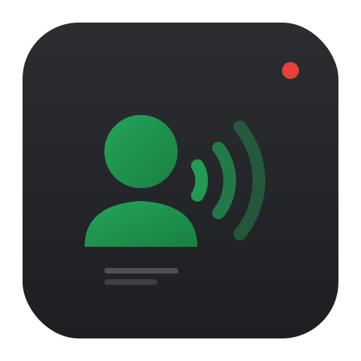
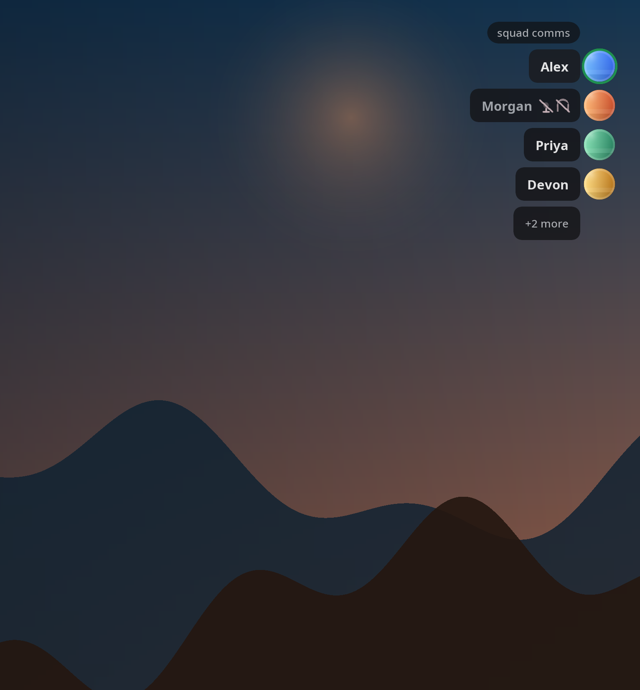
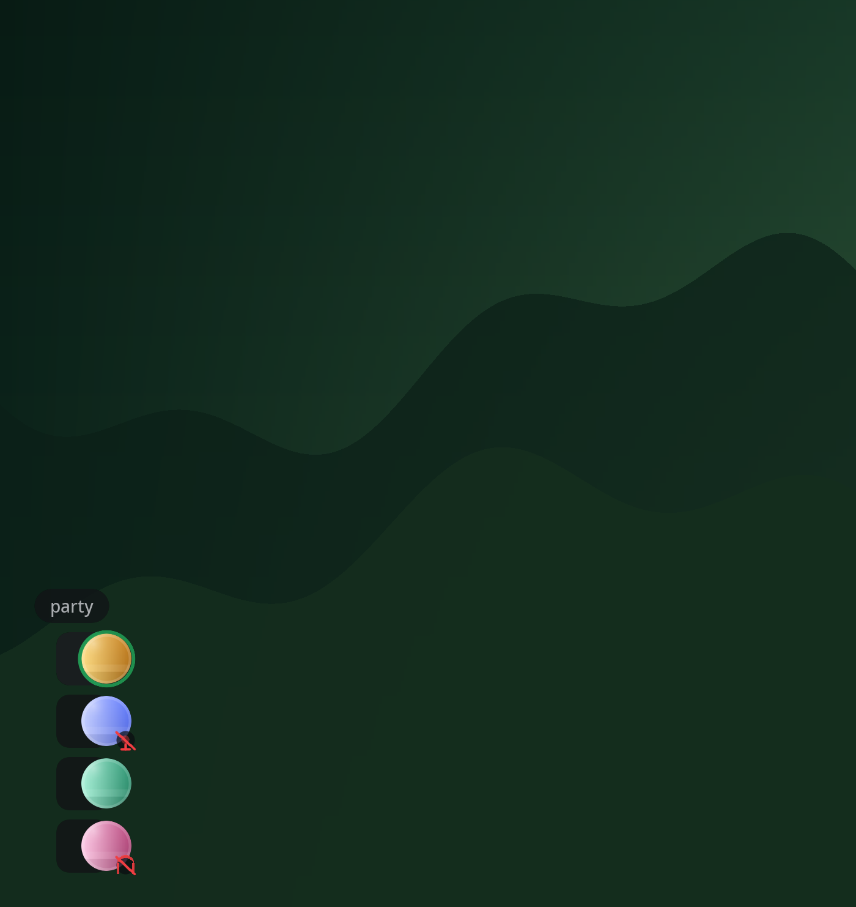
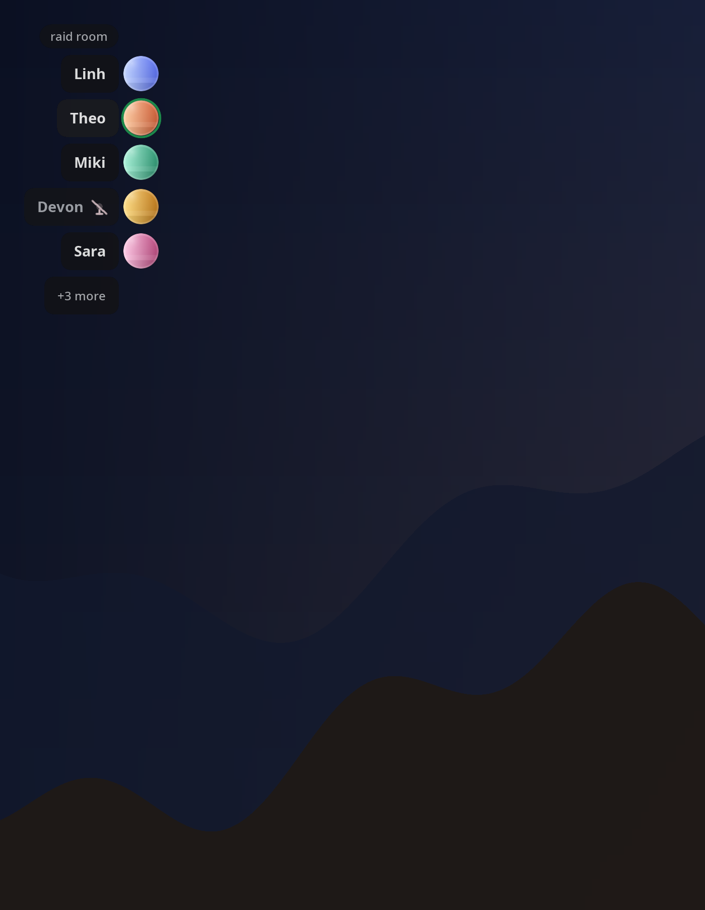

# Sigaw

> *Sigaw* (Filipino: "shout/call"), a Discord voice overlay for Linux that
> works on Wayland fullscreen.

<p align="center">
  
</p>

**Sigaw** renders a Discord voice channel overlay directly inside your game's
Vulkan or OpenGL render pipeline, using the same approach as MangoHUD and DXVK. No
transparent windows, no compositor hacks, no Wayland limitations.

## Why?

[Overlayed.dev](https://overlayed.dev/) and similar overlays use a transparent
window on top of the game. On Linux, that is unreliable for fullscreen Wayland
apps because the compositor is not supposed to let another window draw over the
game surface.

Sigaw takes a different route. It injects the overlay into the application's
own frame instead of relying on the desktop compositor: a **Vulkan implicit
layer** for Vulkan apps, and an **`LD_PRELOAD` swap-buffer hook** for OpenGL.
That makes it work in the cases this project is meant for: Wayland fullscreen,
Gamescope, X11 Vulkan apps, and X11/EGL OpenGL apps.

## Features

- Shows the current Discord voice channel in-game
- Updates speaking, mute, and deaf state live
- Keeps active speakers visible when the channel is larger than the visible row limit
- Supports avatars, compact mode, and basic overlay placement controls
- Runs as a daemon plus Vulkan/OpenGL hooks, with `sigaw-ctl` for control and status

## Example Overlays

Generated from the current renderer on a 3840x2160 test frame. Regenerate them
with `meson compile -C build render-readme-screenshots`.

<table>
  <tr>
    <td width="33%">
      
    </td>
    <td width="33%">
      
    </td>
    <td width="33%">
      
    </td>
  </tr>
  <tr>
    <td align="center"><strong>Standard layout</strong><br/>Channel header, live speaking state, and inline mute icons.</td>
    <td align="center"><strong>Compact mode</strong><br/>Avatar-first rows with badge indicators.</td>
    <td align="center"><strong>Larger channels</strong><br/>Extra users collapse into a <code>+N more</code> row.</td>
  </tr>
</table>

## Limits

- Linux only
- Vulkan applications, plus OpenGL via GLX/EGL
- Discord desktop client only
- Voice overlay only

## Quick Start

### 1. Build and install

```bash
git clone https://git.macco.dev/macco/sigaw.git
cd sigaw
meson setup build --prefix=/usr
meson compile -C build
sudo meson install -C build
```

### 2. Generate the config

```bash
sigaw-daemon --init-config
$EDITOR ~/.config/sigaw/sigaw.conf
```

### 3. Start the daemon

```bash
sigaw-daemon --foreground
```

Or enable the installed user service:

```bash
systemctl --user daemon-reload
systemctl --user enable --now sigaw-daemon
```

On first run, Discord should prompt for authorization.

### 4. Launch an app with Sigaw enabled

```bash
sigaw-run ./my-game
```

Common launch patterns:

```bash
sigaw-run %command%
sigaw-run -- gamescope -f -- %command%
```

Manual paths:

```bash
SIGAW=1 ./vulkan-game
LD_PRELOAD=/usr/lib/libSigawGL.so ./opengl-game
```

### 5. Check that it is working

```bash
sigaw-ctl status
```

If the daemon is connected and you are in a voice channel, `sigaw-ctl status`
shows the current channel, users, and overlay visibility state.

## Requirements

Runtime:

- Linux
- A Vulkan or OpenGL game/application
- Discord desktop app running on the same machine

Build:

- Vulkan headers and loader
- OpenGL/EGL/X11 development files
- Meson
- Ninja
- nlohmann-json
- libcurl
- FreeType
- libpng

Package examples:

**Arch Linux**

```bash
sudo pacman -S vulkan-headers vulkan-icd-loader meson ninja \
    nlohmann-json curl freetype2 libpng
```

**Ubuntu / Debian**

```bash
sudo apt install libvulkan-dev meson ninja-build \
    nlohmann-json3-dev libcurl4-openssl-dev \
    libfreetype-dev libpng-dev
```

## Configuration

Sigaw keeps its config in `~/.config/sigaw/sigaw.conf`.

| Option              | Default     | Description                                                            |
| ------------------- | ----------- | ---------------------------------------------------------------------- |
| `position`          | `top-right` | Overlay anchor: `top-left`, `top-right`, `bottom-left`, `bottom-right` |
| `scale`             | `1.0`       | Overall size multiplier                                                |
| `opacity`           | `0.72`      | Overlay opacity from `0.0` to `1.0`                                    |
| `show_avatars`      | `true`      | Show Discord avatars when available                                    |
| `show_channel_name` | `false`     | Show a channel header above the user list                              |
| `compact`           | `false`     | Render a smaller avatar-first layout                                   |
| `max_visible_users` | `8`         | Maximum rows shown before collapsing the rest into `+N more`           |
| `visible`           | `true`      | Persisted overlay visibility, usually managed by `sigaw-ctl`           |

Example config: [`sigaw.conf.example`](sigaw.conf.example).

## CLI

`sigaw-ctl` supports:

- `sigaw-ctl status` shows daemon, voice, and overlay state
- `sigaw-ctl toggle` toggles overlay visibility
- `sigaw-ctl reload` reloads the config file
- `sigaw-ctl stop` stops the daemon
- `sigaw-ctl config` prints the active config path

## Troubleshooting

If the overlay does not appear:

- Start it with `sigaw-run <game>`.
- For Vulkan-only debugging, try `SIGAW=1 <game>`.
- For OpenGL-only debugging, try `LD_PRELOAD=/usr/lib/libSigawGL.so <game>`.
- Verify the daemon is running with `sigaw-ctl status`.
- If you installed from source, confirm `sudo meson install -C build` completed successfully.
- Avoid stacking another swap-buffer interposer on top of Sigaw.

If Discord never prompts for authorization:

- Re-check `client_id` and `client_secret`.
- Keep the Discord desktop client open while starting `sigaw-daemon`.

If you need daemon logs:

```bash
journalctl --user -u sigaw-daemon -f
```

## Related Projects

- [MangoHUD](https://github.com/flightlessmango/MangoHud)
- [vkBasalt](https://github.com/DadSchoorse/vkBasalt)
- [Overlayed](https://overlayed.dev/)
- [DXVK](https://github.com/doitsujin/dxvk)

## License

MIT. See [LICENSE](LICENSE).
